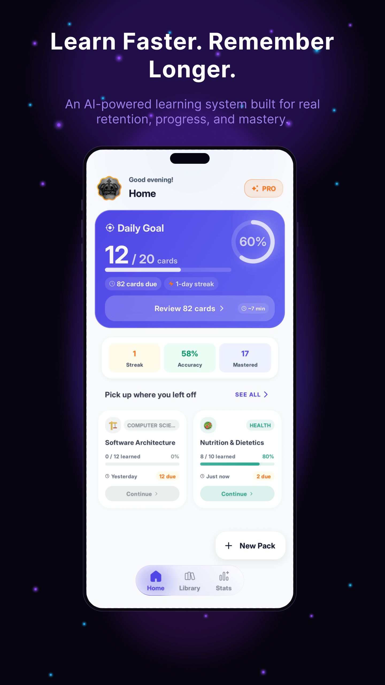
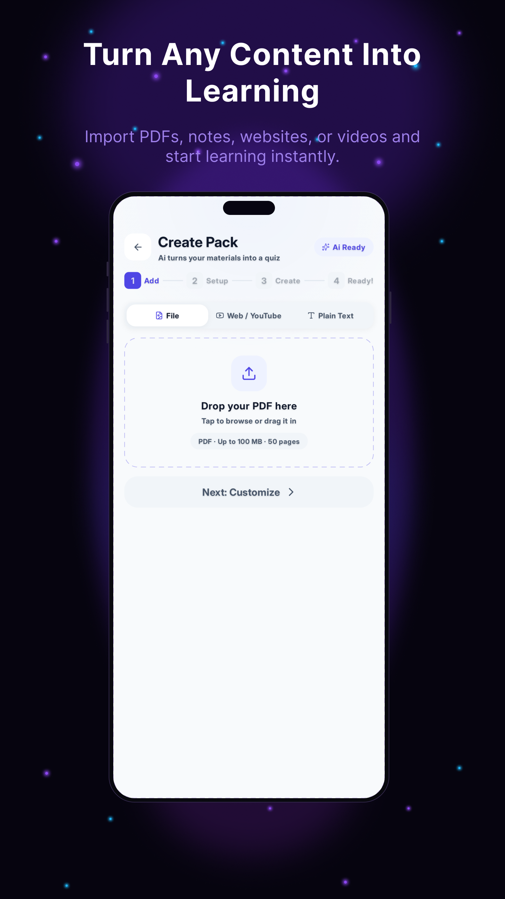
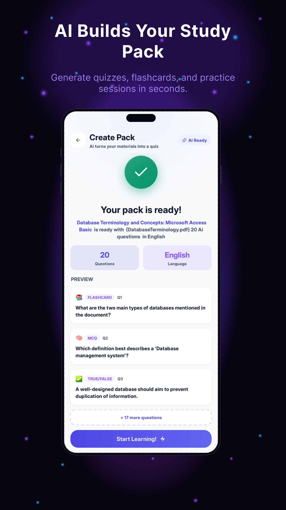
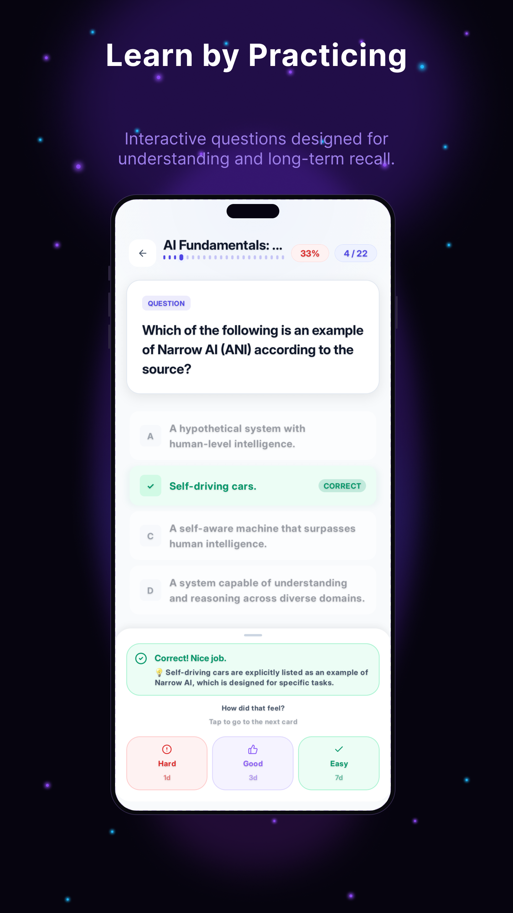
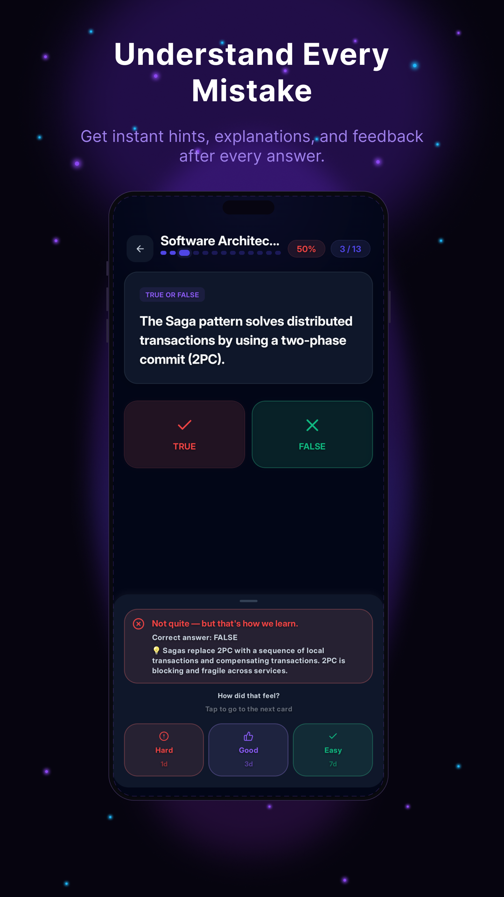
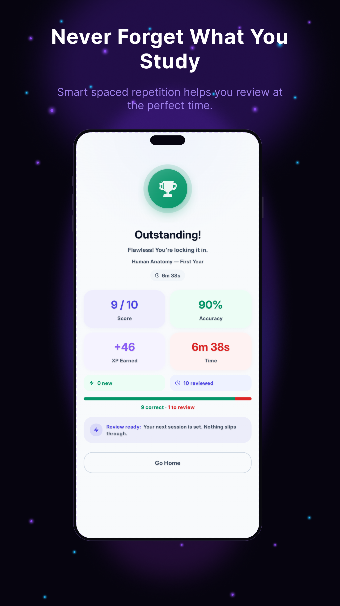
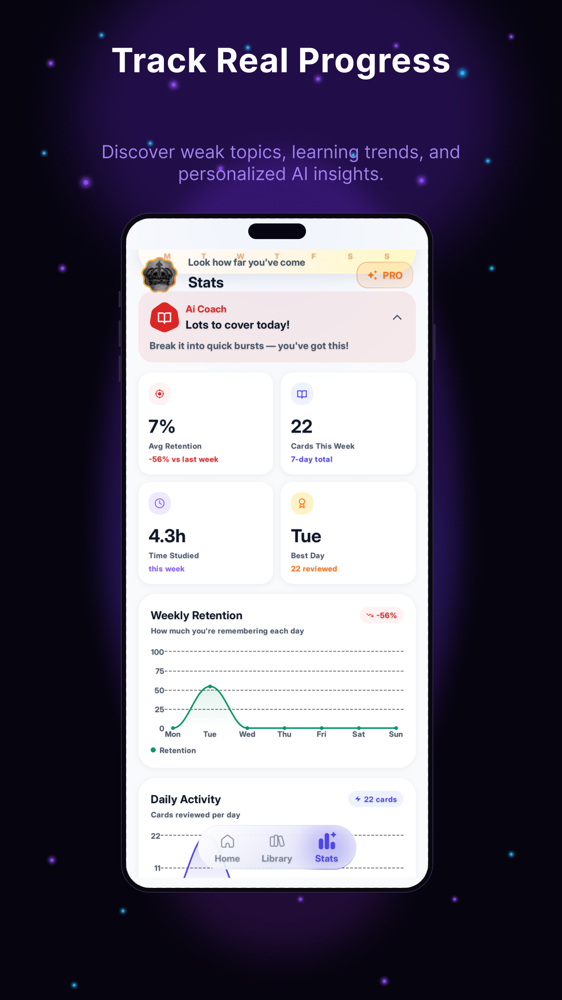
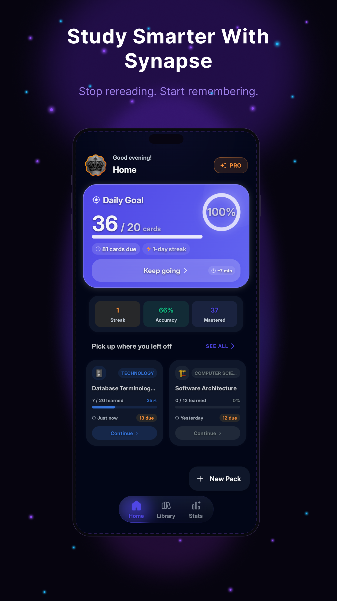

<div align="center">


# 🧠 Synapse — AI-Powered Knowledge Retention

### *Turn anything into long-term memory.*

<br/>


[](https://opensource.org/licenses/Apache-2.0)
[](https://github.com/AmgadGhozzy/Synapse/pulls)

<br/>

[](https://play.google.com/store/apps/details?id=com.amgad.synapse)

</div>

---

<details>
<summary><kbd>📋 Table of Contents</kbd></summary>

- [What is Synapse?](#-what-is-synapse)
- [Why Synapse?](#-why-synapse-not-anki-not-quizlet)
- [Key Features](#-key-features)
- [Screenshots](#-screenshots)
- [Architecture](#-architecture)
- [Tech Stack](#-tech-stack)
- [Getting Started](#-getting-started)
- [Usage Flow](#-usage-flow)
- [Project Structure](#-project-structure)
- [Contributing](#-contributing)
- [License](#-license)

</details>

---

## 🎯 What is Synapse?

Synapse is a **zero-friction knowledge ingestion pipeline** disguised as a flashcard app.

It combines **generative AI**, **OCR**, and **scientifically proven Spaced Repetition (SRS)** to transform passive documents — PDFs, images, YouTube transcripts — into personalized, adaptive study sessions. No manual card creation. No copy-pasting. Just drop in your material and let the engine do the rest.

Built for **medical students**, **law graduates**, **professional certification candidates**, and anyone who needs to absorb dense knowledge at scale — fast.

---

## 🆚 Why Synapse? (Not Anki. Not Quizlet.)

| Dimension | Anki | Quizlet | **Synapse** |
|---|---|---|---|
| Card Creation | Manual, hours of setup | Manual or buy pre-made | ✅ **AI-generated in seconds** |
| Source Input | None | None | ✅ **PDF / Image / YouTube** |
| Scheduling Algorithm | Advanced SRS (manual config) | Basic linear | ✅ **Adaptive SRS (auto-tuned)** |
| Offline Support | Full | Partial | ✅ **Offline-first with cloud sync** |
| On-Device AI | None | None | ✅ **Google Cloud Vision + GenAI** |
| Onboarding Friction | High | Medium | ✅ **Zero — anonymous by default** |
| Feel | Spreadsheet | Toy | ✅ **Modern SaaS product** |

> **Core thesis:** Anki demands too much setup; Quizlet demands too little depth. Synapse occupies the gap — frictionless intake, rigorous retention.

---

## ✨ Key Features

### ⚡ Zero-Friction Content Ingestion
Drop in a **PDF**, photograph a textbook page via **camera/document scanner**, paste a **YouTube link** (transcript extraction), import a **web article**, or type in plain text. Synapse's AI pipeline parses, extracts key concepts, and structures them into targeted quiz cards — in seconds. No reformatting, no copy-paste, no manual tagging.

### 🤖 AI-Powered Card Generation
Powered by **Google Gemini** (primary) and **Groq** (low-latency fallback) with SSE streaming, the generation engine produces **Multiple Choice**, **True/False**, and **Flashcard** formats per concept. "Deep Thinking" mode (Pro) uses enhanced models for more nuanced card generation. Cards are precision-targeted recall challenges designed to expose gaps in understanding.

### 🔁 Adaptive Spaced Repetition Engine (SM-2)
Custom **SM-2 algorithm** (`SynapseSmTwoAlgorithm`) with stale-gap penalty handling for overdue cards, leech detection, and auto-configurable ease factors. Every card has a live `easeFactor` and `intervalDays` updated after each `HARD/GOOD/EASY` rating. A **two-phase answer flow** (submit → rate difficulty) prevents SRS interval gaming.

### 🧠 AI Coach & Insights
Context-aware insight cards on the dashboard: new user encouragement, streak fire motivators, accuracy trend analysis, and personalized study tips — generated dynamically based on your study patterns.

### 📊 Comprehensive Statistics & Streaks
Detailed stats with **weekly heatmap**, accuracy tracking, total study time, and average retention with **week-over-week delta**. Beautiful charts powered by **Vico**. Streak tracking with fire emoji progression.

### 📥 Marketplace (Community Packs)
Browse and download pre-made study packs from the community marketplace. Share your own packs with others. Discover content across various subjects.

### 📄 Export to PDF & Word
Export your study packs to **PDF** and **Microsoft Word** documents. Optional watermark for free users with a monthly export limit. Pro tier removes watermarks and limits.

### 🎙️ Text-to-Speech (TTS)
Built-in **Text-to-Speech** engine for listening to question content. Supports multiple voices and languages. Separate `TtsManager` and `TtsRepository` for flexible voice selection.

### 🗺️ Mind Map Mode
Visualize connections between concepts with an interactive **Mind Map** view during study sessions. Navigate related cards spatially.

### 🔐 Resilient Subscription & Entitlement System
Built on a **state-machine driven `EntitlementManager`** with:
- Server-side validation via Supabase Edge Functions
- Local DataStore fallback for network outages
- A rigorous **48-hour offline grace window** with clock-drift prevention (`clockOffsetMs`)
- Mutex-guarded concurrent validation prevention

### 📡 Intelligent Offline-First Sync
**Room DB** serves as the fast, local execution layer. **Supabase Postgres** is the canonical cloud backup. The `SyncMediator` handles **push/pull on boot**, anonymous-to-authenticated data migration, soft-delete cascade queuing, incremental pull, and Last-Write-Wins conflict resolution.

### 🆔 Anonymous-First Onboarding
Users are silently assigned a secure **anonymous UUID** on first launch — no sign-up wall, no friction. Study locally with full SRS tracking. Upgrade to **Google Sign-In** at any point and all data migrates seamlessly.

### 🔔 Daily Reminders & Notifications
**AlarmManager**-based daily study reminders with boot-reboot restoration. Dedicated `NotificationChannel` for "Study Reminders" with customizable notification preferences.

### 🎉 Gamification & Feedback
Celebration animations via **Konfetti** particle effects on session completion. Performance tiers (flawless/great/keep-going) with encouraging messages, streak fire emojis, and progress rings.

### 🎨 Custom Adaptive Design System
Fully custom design tokens (`MaterialTheme.synapse`) with adaptive spacing (`sm/md/lg`), radius, shadows, semantic colors, and gradients. Hard rule: no `.dp` or `.sp` — only `.adp` and `.asp` for adaptive scaling.

### 🌍 Full Localization (English + Arabic)
Complete **English** and **Arabic** support with full **RTL layout**. 1200+ carefully authored strings with strict naming conventions. No hardcoded strings anywhere.

### 📱 Session Engine & Study Modes
Multiple study modes: **MIXED**, **MCQ_ONLY**, **FLASHCARD_ONLY**, **TF_ONLY**, **SMART**, and **MISTAKES_ONLY**. Session auto-save, two-phase answer flow, performance summaries with next-review scheduling.

---

## 📸 Screenshots

<div align="center">

| | | | |
|---|---|---|---|
| <br/><sub>**Learn Faster**</sub> | <br/><sub>**Turn Any Content Into Learning**</sub> | <br/><sub>**AI Builds Your Study Pack**</sub> | <br/><sub>**Learn by Practicing**</sub> |
| <br/><sub>**Understand Every Mistake**</sub> | <br/><sub>**Never Forget What You Study**</sub> | <br/><sub>**Track Real Progress**</sub> | <br/><sub>**Study Smarter With Synapse**</sub> |

</div>

---

## 🏗️ Architecture

Synapse is built following **Google's Modern Android Development (MAD)** guidelines with a strict **Clean Architecture** layering — no shortcuts, no anti-patterns.

```
UI Layer (Compose Screens + ViewModels)
        ↕  UiState / UiEffect / UiEvent
Domain Layer (UseCases + Domain Models)
        ↕  Repository Interfaces
Data Layer (Room + Supabase + AI APIs)
        ↕  SyncMediator (offline queue)
Remote (Supabase Postgres + Edge Functions)
```

### Layer Breakdown

| Layer | Responsibility |
|---|---|
| **UI** | Compose screens, ViewModels, StateFlow-driven unidirectional data flow |
| **Domain** | Pure Kotlin UseCases, domain models, zero Android dependencies |
| **Data** | Room DAOs, Supabase REST client, AI pipeline adapters |
| **Sync** | `SyncMediator` — handles boot sync, migration, offline queue, conflict resolution |
| **Entitlements** | `EntitlementManager` — subscription state machine, grace windows, offline fallback |

### Concurrency Model
All async operations run on structured **Kotlin Coroutines** with **StateFlow** emitting unidirectional state updates. The `SyncMediator` and `EntitlementManager` use `Mutex` guards to prevent concurrent execution races.

---

## 🛠️ Tech Stack

<div align="center">


</div>

### Frontend
| Library | Version | Purpose |
|---|---|---|---|
| Jetpack Compose BOM | 2026.03.01 | Declarative, reactive UI |
| Material 3 | 1.5.0-alpha16 | Design system and dynamic theming |
| Navigation Compose | 2.8.9 | Type-safe screen navigation |
| Compose Animation | 1.11.0-beta02 | Rich enter/exit animations |
| Coil | 2.7.0 | Async image loading |
| Vico | 3.0.2 | Charts and statistics |
| M3Color | 2025.4 | Dynamic Material 3 color schemes |
| Konfetti | 2.0.5 | Celebration particle effects |
| Accompanist Permissions | 0.37.0 | Runtime permission handling |
| Google Fonts (Inter, Cairo) | 1.6.7 | Custom typography |
| Material 3 Window Size Class | 1.4.0 | Adaptive layout support |

### Backend & Data
| Service | Version | Purpose |
|---|---|---|---|
| Supabase | 3.4.1 | Auth, Postgres REST, Edge Functions |
| Room | 2.8.4 | Offline-first local persistence (SQLite ORM) |
| DataStore Preferences | 1.1.2 | Lightweight config + entitlement caching |
| Retrofit | 2.11.0 | HTTP client (TTS API) |
| OkHttp | 4.12.0 | HTTP client with interceptors (AI: 180s timeout) |
| Kotlinx Serialization JSON | 1.8.0 | JSON serialization/deserialization |
| Ktor OkHttp | 3.1.3 | HTTP engine for Supabase SDK |

### AI & ML
| Engine | Purpose |
|---|---|
| Google GenAI (Gemini) | Primary card generation LLM (SSE streaming) |
| Groq | Low-latency fallback LLM |
| ML Kit Text Recognition | OCR for images and scanned documents |
| ML Kit Document Scanner | Camera-based document scanning |
| ML Kit Translate | Translation support |

### Infrastructure
| Tool | Version | Purpose |
|---|---|---|---|
| Kotlin | 2.3.10 | Language |
| KSP | 2.3.7 | Annotation processing |
| Hilt | 2.57.1 | Compile-time dependency injection |
| Firebase BOM | 33.9.0 | Analytics, Crashlytics, Remote Config, Cloud Messaging |
| WorkManager | 2.9.0 | Background sync & entitlement validation |
| Ktor OkHttp | 3.1.3 | HTTP client engine for Supabase SDK |
| Google Play Billing | 8.3.0 | In-app subscriptions |
| Android Credential Manager | 1.3.0 | Google Sign-In authentication |
| Media3 ExoPlayer | 1.7.1 | Video/audio playback |

### Testing
| Library | Version | Purpose |
|---|---|---|
| JUnit 5 (Jupiter) | 5.10.2 | Unit testing |
| MockK | 1.13.7 | Kotlin mocking framework |
| Kotlinx Coroutines Test | 1.7.3 | Async coroutine testing |
| Compose UI Test | — | UI component testing |
| Baseline Profile | 1.4.1 | AOT compilation optimization |

---

## 🚀 Getting Started

### Prerequisites

- Android Studio **Hedgehog** (2024.1.1) or later
- Android SDK **API 24+**
- Kotlin **2.3+**
- A Supabase project (for backend features)
- Google Cloud project with **GenAI API** enabled

### 1. Clone the Repository

```bash
git clone https://github.com/AmgadGhozzy/Synapse.git
cd Synapse
```

### 2. Configure API Keys

Create a `local.properties` file in the project root and add:

```properties
SUPABASE_URL=your_supabase_project_url
SUPABASE_ANON_KEY=your_supabase_anon_key
GOOGLE_WEB_CLIENT_ID=your_google_web_client_id
```

> ⚠️ Never commit `local.properties` to version control. It is already in `.gitignore`.

### 3. Set Up Supabase

Deploy the required Edge Functions from the `/supabase/functions/` directory:

```bash
supabase functions deploy generate-pack
supabase functions deploy validate-subscription
```

### 4. Build & Run

```bash
# Open in Android Studio and sync Gradle
# Or via CLI:
./gradlew assembleDebug
./gradlew installDebug
```

---

## 🧪 Usage Flow

### First-Time User

1. **Launch** → App assigns a secure anonymous UUID. No sign-up wall.
2. **Import** → Tap `+`, choose PDF / Camera / YouTube URL.
3. **Generate** → AI pipeline extracts concepts and creates a card pack (10–50 cards).
4. **Study** → Tap the pack. Answer MCQs and rate flashcards with `Hard / Good / Easy`.
5. **Review Queue** → Return the next day. The SRS engine surfaces exactly the cards due for review.
6. **Upgrade** → Link Google Account for cross-device sync. Upgrade to Pro for unlimited packs.

### Returning User

1. Daily goal card shows review queue count.
2. Tap **Start Review** to work through due cards.
3. Session ends with performance summary and next review schedule.

---

## 📁 Project Structure

```
Synapse/
├── app/
│   ├── src/main/
│   │   ├── java/io/synapse/ai/
│   │   │   ├── core/                  # Core framework, UI components, and theming
│   │   │   ├── data/                  # Room DAOs, remote API (Supabase), Repositories, and Sync
│   │   │   ├── di/                    # Hilt Dependency Injection modules
│   │   │   ├── domain/                # Pure Kotlin domain models, Repositories bounds, and SRS logic
│   │   │   ├── features/              # Feature-based UI architecture (Dashboard, Session, Premium, etc.)
│   │   │   ├── navigation/            # Compose Navigation graph and definitions
│   │   │   └── ui/                    # Base UI theme configurations and properties
│   │   └── res/
├── supabase/
│   └── functions/
│       ├── generate-pack/               # AI card generation orchestrator
│       └── validate-subscription/       # Server-side entitlement validator
├── screenshots/              # App screenshots for README gallery
└── README.md
```

---

## 🤝 Contributing

Contributions are what make open-source projects thrive. All improvements — bug fixes, features, documentation — are welcome.

### Workflow

1. **Fork** the repository
2. **Create** a feature branch:
   ```bash
   git checkout -b feature/your-feature-name
   ```
3. **Follow** the existing architecture:
   - New features belong in the `domain → data → presentation` layers
   - No direct Supabase calls from ViewModels — always through UseCases
   - New screens must emit `UiState`, `UiEffect`, and consume `UiEvent`
4. **Commit** with a clear message:
   ```bash
   git commit -m "feat: add semester pass one-time billing flow"
   ```
5. **Push** and open a **Pull Request** against `main`

### Code Standards
- 100% Kotlin, Jetpack Compose UI only
- ViewModels must be pure — no Android context references
- All repository methods must have local Room fallback before remote calls
- No hard-coded strings — use `strings.xml`
- Test coverage with JUnit 5 and MockK

---

## ⚖️ License

```
Copyright 2026 Amgad Ghozzy

Licensed under the Apache License, Version 2.0 (the "License");
you may not use this file except in compliance with the License.
You may obtain a copy of the License at

    http://www.apache.org/licenses/LICENSE-2.0

Unless required by applicable law or agreed to in writing, software
distributed under the License is distributed on an "AS IS" BASIS,
WITHOUT WARRANTIES OR CONDITIONS OF ANY KIND, either express or implied.
See the License for the specific language governing permissions and
limitations under the License.
```

---

<div align="center">

## ⭐ Love Synapse?

If Synapse saves you even one hour of manual flashcard creation, give it a star.  
It means everything for a solo-built, independently published product.

[](https://github.com/AmgadGhozzy/Synapse/stargazers)
[](https://github.com/AmgadGhozzy)

### Connect

[](https://github.com/AmgadGhozzy/Synapse)
[](https://www.linkedin.com/in/amgadghozzy/)
[](mailto:AmgadGhozzy@gmail.com)

### 💬 Support & Feedback

Found a bug? Have a feature idea? Reach out directly.

📧 **[AmgadGhozzy@gmail.com](mailto:AmgadGhozzy@gmail.com)**

---

**Made with obsession by [Amgad Ghozzy](https://www.linkedin.com/in/amgadghozzy)**

*Learn fast. Remember forever.*

</div>
